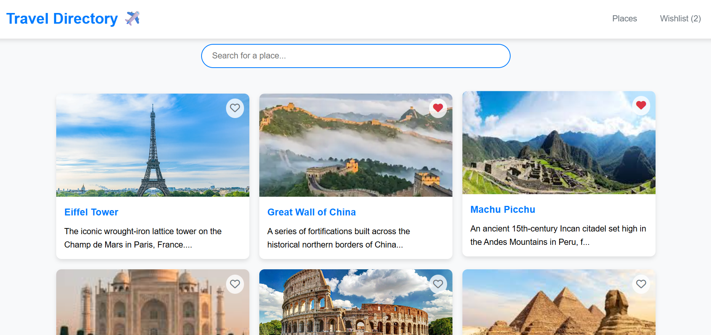
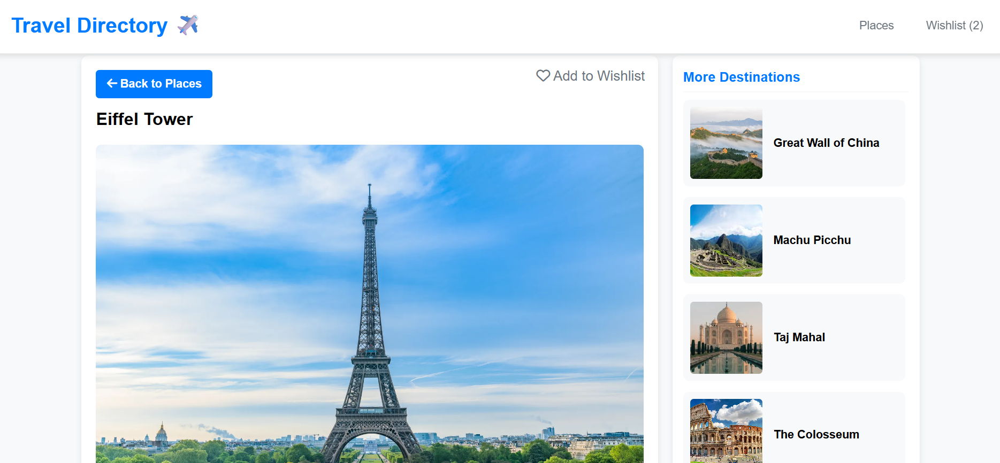
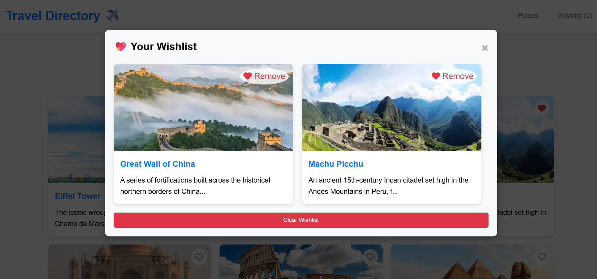

# 🌎 Travel Places Directory

A sophisticated, responsive web application designed for exploring global landmarks. This project showcases a clean UI/UX approach, combining high-quality imagery with functional data management.

---

## ✨ Key Features

### 🖼️ UI/UX Design & Gallery
* **Main Gallery View:** A clean, grid-based layout using CSS Flexbox and Grid for optimal spacing.
* **70/30 Detail View:** A professional split-screen experience where the destination's rich content occupies 70% of the screen, while a scrollable "More Destinations" sidebar occupies the remaining 30%.

    
   
 ## Main Gallery 
 
  
 
## Detail View

 
 
## Wishlist 

 

### 🛠️ Functionality
* **🔍 Real-time Search:** Filter destinations instantly by name or description.
* **🌐 Double-Click Knowledge:** For a more immersive experience, **double-clicking** any destination card automatically opens its official Wikipedia page in a new tab, providing instant historical and travel insights.
* **💖 Persistent Wishlist:** Save favorites to a personal list that stays saved even after refreshing the page, thanks to `localStorage`.

---

## 🛠️ Tech Stack & Implementation

| Technology | Purpose |
| :--- | :--- |
| **HTML5** | Semantic structure and SEO accessibility. |
| **CSS3** | Modern styling, custom properties (variables), and responsive design. |
| **JavaScript (ES6+)** | The engine behind the search, wishlist logic, and dynamic UI rendering. |

### Why I used Vanilla JavaScript:
I chose to build this using **Vanilla JavaScript** to demonstrate a deep understanding of DOM manipulation and data handling. Following my recent technical milestones, this project allowed me to implement:
1.  **Dynamic Rendering:** Generating UI components directly from JSON data.
2.  **State Management:** Handling the 'Wishlist' state without external libraries.
3.  **Event Listeners:** Implementing advanced interactions like the double-click Wikipedia trigger and click-outside modal closing.

---

## 📂 Project Structure

```text
├── index.html      # UI structure & Modal systems
├── style.css       # Layout, 70/30 split styles, & animations
├── script.js       # Core logic, Wikipedia integration, & search
└── README.md       # Project documentation
